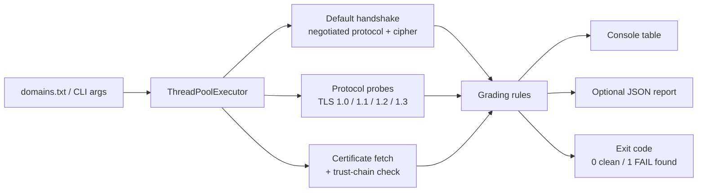

# tls-config-auditor

A command-line tool that checks a list of domains' TLS configuration against current best practice: which protocol versions they still accept, whether the negotiated cipher suite is weak, and how close each certificate is to expiry. Built to catch the kind of TLS drift — a legacy protocol left enabled, a certificate nobody renewed — that a manual `openssl s_client` check only catches if someone remembers to run it.

## How it works



Each domain is scanned on its own thread: one connection negotiates normally to see what a real client would get, four more are pinned to a single protocol version each to see what the server *still* accepts, and one final connection runs full certificate-chain validation against the system trust store.

## Best-practice baseline

| Check | Rule applied | Reference |
|---|---|---|
| Protocol version | TLS 1.0 / 1.1 (or SSLv3) accepted → fail; TLS 1.2 only → warn; TLS 1.3 offered → pass | RFC 8996; NIST SP 800-52 Rev. 2 |
| Cipher suite | Negotiated cipher matches a weak pattern (RC4, 3DES, NULL, EXPORT, anonymous, MD5, PSK) → fail; CBC-mode suite on TLS 1.2 → warn | Mozilla "Intermediate" TLS configuration |
| Certificate expiry | Expired or within `--crit-days` (default 14) → fail; within `--warn-days` (default 30) → warn | Standard operational practice |
| Certificate validity period | Longer than 398 days → warn | CA/Browser Forum Baseline Requirements |
| Key strength | RSA < 2048 bits or EC < 224 bits → fail | NIST SP 800-57 |
| Trust chain | Certificate does not validate against the system trust store → fail | — |

## Usage

```bash
pip install -r requirements.txt

# Scan specific domains
python -m tls_audit github.com example.com

# Scan a list, write a JSON report, and fail the build on warnings too
python -m tls_audit --domains-file domains.txt --json tls_report.json --strict
```

Sample output:

```
Domain                 Status    Protocol    Cipher                        Cert days left  Top issue(s)
----------------------  --------  ----------  ----------------------------  --------------  --------------------------------------------------------
github.com              PASS      TLSv1.3     TLS_AES_128_GCM_SHA256        210             -
expired.badssl.com      FAIL      TLSv1.2     ECDHE-RSA-AES128-GCM-SHA256   -3              Certificate expired 3 day(s) ago.
tls-v1-0.badssl.com     FAIL      TLSv1.0     ECDHE-RSA-AES128-SHA          140             Deprecated protocol(s) still accepted: TLSv1
rc4.badssl.com          FAIL      TLSv1.0     ECDHE-RSA-RC4-SHA             365             Deprecated protocol(s) still accepted: TLSv1; Negotiated cipher matches weak pattern(s): RC4
```

Exit code is `1` if any domain comes back `FAIL` (or `WARN` too, with `--strict`) — designed to run as a CI gate.

## Installation

```bash
git clone https://github.com/MuhammadMurtuzaHussain/tls-config-auditor.git
cd tls-config-auditor
pip install -r requirements.txt
```

## Testing

```bash
pip install -r requirements-dev.txt
pytest
```

`grading.py` holds all scoring logic as pure functions, so `tests/test_grading.py` runs without touching a socket. `.github/workflows/ci.yml` runs Ruff, Black and pytest on every push and pull request that touches a `.py` file.

## Limitations

This is a practical drift-detection tool, not a replacement for a dedicated scanner. It checks the protocol versions a server accepts and the cipher negotiated by default rather than enumerating every cipher suite a server offers in every order; for exhaustive analysis (cipher preference order, OCSP stapling, HSTS, known CVEs), use [testssl.sh](https://testssl.sh) or [SSLyze](https://github.com/nabla-c0d3/sslyze). Results for TLS 1.0/1.1 also depend on the OpenSSL build running the scanner — some distributions disable those protocols client-side entirely, in which case they show as unsupported rather than verified against the server.

## License

MIT — see [LICENSE](./LICENSE).
